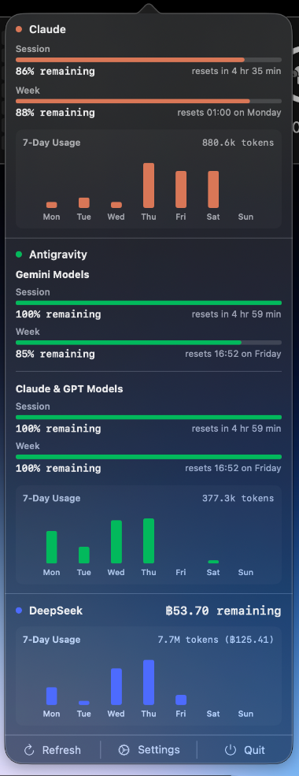

# TokenBar 🪙

TokenBar is a native macOS menu bar application designed to monitor your AI provider token usage, API balances, and remaining quotas in real-time. Keep track of your spending and limits for Claude, DeepSeek, and local language servers (Antigravity) directly from your menu bar.

<p align="center">
  
</p>

---

## Features

### 📊 Multi-Provider Tracking
- **Claude (Anthropic API):** Monitor official utilization session/weekly limits and view your active quota window directly in the menu bar.
- **DeepSeek:** Track your platform API balance (USD/CNY). Supports live currency conversion to Thai Baht (฿) using reference rates from the European Central Bank (ECB).
- **Antigravity:** Track local language server remaining quotas and reset times for Gemini, Claude, and GPT models.

### 📈 Interactive 7-Day Usage Graphs
- Visualizes daily token consumption for each active provider.
- Configurable **First Day of Week** (Sunday or Monday) to align with your preference.
- Fused graphs option to combine multiple model usage tracks into a single unified chart.
- Toggle between shared global graph scales or separate auto-scaled peaks.

### ⚙️ Customizable Settings
- **Remaining Mode:** Toggle globally to show remaining quotas/balances instead of used values.
- **Provider Ordering:** Easily drag or move providers to customize the order in which they appear.
- **Polling Intervals:** Configure automatic background refresh intervals (30s, 1m, 2m, or 5m).

### 🔒 Secure Credentials
- All sensitive information (such as DeepSeek API keys) is stored locally and securely in the macOS Keychain.

---

## Getting Started

### Prerequisites
- **macOS** 14.0 (Sonoma) or newer
- **Xcode** 15.0 or newer (for building from source)
- **Swift** 5.9+

### Installation

1. **Clone the repository:**
   ```bash
   git clone https://github.com/H1B1CU2/TokenBar.git
   cd TokenBar
   ```

2. **Open in Xcode:**
   ```bash
   open TokenBar.xcodeproj
   ```

3. **Build and Run:**
   - Select the `TokenBar` scheme.
   - Choose **Any Mac** or your local Mac as the run destination.
   - Press `⌘R` to build and run.

---

## Configuration Details

### Claude Integration
TokenBar reads your official Claude usage via your Claude Code access token, which is automatically resolved from your secure Keychain or credentials file.

### DeepSeek Integration
Enter your DeepSeek API key (`sk-...`) in the **DeepSeek** tab within settings. The balance can optionally be converted to Thai Baht (฿) using live conversion rates from the Frankfurter API.

### Antigravity Integration
Connects to your local Antigravity Language Server instance (listening on default local ports) to query Gemini and Claude/GPT model session & weekly limits.

---

## License

This project is licensed under the MIT License - see the LICENSE file for details.